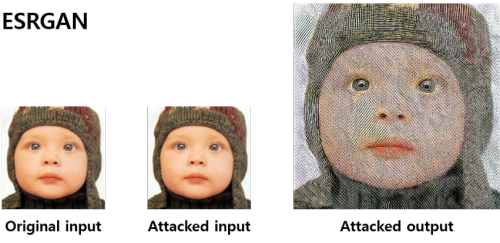

# Adversarial Attack on Super-resolution Models



This repository contains the official TensorFlow-based implementation of the adversarial attack method for super-resolution models, which is explained in the following paper.
- J.-H. Choi, H. Zhang, J.-H. Kim, C.-J. Hsieh, J.-S. Lee. Evaluating robustness of deep image super-resolution against adversarial attacks. IEEE International Conference on Computer Vision (ICCV), pp. 303-311, October 2019 **[[Paper]](http://openaccess.thecvf.com/content_ICCV_2019/html/Choi_Evaluating_Robustness_of_Deep_Image_Super-Resolution_Against_Adversarial_Attacks_ICCV_2019_paper.html)** **[[arXiv]](https://arxiv.org/abs/1904.06097)**
```
@inproceedings{choi2019evaluating,
  title={Evaluating robustness of deep image super-resolution against adversarial attacks},
  author={Choi, Jun-Ho and Zhang, Huan and Kim, Jun-Hyuk and Hsieh, Cho-Jui and Lee, Jong-Seok},
  booktitle={Proceedings of the IEEE/CVF International Conference on Computer Vision},
  pages={303--311},
  year={2019}
}
```


## Dependencies

- Python 3.6+
- TensorFlow 1.12+ (<2.0)


## Preparing a target model

This code requires a target model saved as a "Frozen Graph" format.
We are providing some pre-trained state-of-the-art super-resolution models on the [SRZoo](https://github.com/idearibosome/srzoo) repository.

Followings are the overall procedures to prepare a target super-resolution model.

- Download a target model from the [SRZoo](https://github.com/idearibosome/srzoo) repository or prepare a frozen model by yourself.
- Copy the frozen model to the ```targets/graphs/``` folder.
- Create a configuration file on the ```targets/configs/``` folder.

This repository contains an example target super-resolution model (EDSR-baseline) having an upscaling factor of 4.
You can find the frozen model and its configuration file on ```targets/graphs/edsr_baseline_x4.pb``` and ```targets/configs/edsr_baseline.json```, respectively.


## Finding perturbation for each image (basic attack)

The basic attack can be employed via ```train_bulk.py```, e.g.,
```shell
python train_bulk.py
  --dataloader=basic_loader
  --data_input_path=/tmp/dataset/bsd100/lr/x4
  --data_truth_path=/tmp/dataset/bsd100/hr
  --model=ifgsm
  --model_alpha=0.03137255
  --model_eps=0.03137255
  --sr_config_path=targets/configs/edsr_baseline.json
  --scale=4
  --max_steps=50
  --train_path=/tmp/srattack/edsr_baseline/bsd100/eps8
  --cuda_device=0
```

Arguments:
- ```data_input_path```: Path of the input (low-resolution) images.
- ```data_truth_path```: Path of the ground-truth (high-resolution) images.
- ```model_alpha```: The amount of perturbation for each iteration, which is adjusted by the number of iterations (i.e., ```model_alpha / max_steps``` is the final amount of perturbation for each iteration).
- ```model_eps```: The maximum amount of perturbation. The perturbation will be clipped within the range of ```[-model_eps, +model_eps]```.
- ```sr_config_path```: Path of the configuration file for the target super-resolution model.
- ```scale```: The upscaling factor.
- ```max_steps```: The number of iterations to find a perturbation.
- ```train_path```: Path of the destination folder to save attacked images and their corresponding perturbations.
- ```cuda_device```: Index of the CUDA device to be used (will be set to the environment variable ```CUDA_VISIBLE_DEVICES```).


## Finding universal perturbation (universal attack)

The universal attack can be employed via ```train_universal.py```, e.g.,
```shell
python train_universal.py
  --dataloader=universal_loader
  --data_input_path=/tmp/dataset/bsd100/lr/x4
  --data_truth_path=/tmp/dataset/bsd100/hr
  --model=ifgsm
  --model_alpha=0.03137255
  --model_eps=0.03137255
  --model_averaged_gradients
  --sr_config_path=targets/configs/edsr_baseline.json
  --scale=4
  --max_steps=50
  --patch_size=80
  --model_input_width=80
  --model_input_height=80
  --train_path=/tmp/srattack/universal/edsr_baseline/bsd100/eps8
  --cuda_device=0
```

Arguments:
- ```data_input_path```: Path of the input (low-resolution) images.
- ```data_truth_path```: Path of the ground-truth (high-resolution) images.
- ```model_alpha```: The amount of perturbation for each iteration, which is adjusted by the number of iterations (i.e., ```model_alpha / max_steps``` is the final amount of perturbation for each iteration).
- ```model_eps```: The maximum amount of perturbation. The perturbation will be clipped within the range of ```[-model_eps, +model_eps]```.
- ```model_averaged_gradients```: This argument is required to obtain a single perturbation that is calculated on every input image via averaging the gradients.
- ```sr_config_path```: Path of the configuration file for the target super-resolution model.
- ```scale```: The upscaling factor.
- ```max_steps```: The number of iterations to find a perturbation.
- ```patch_size```, ```model_input_width```, ```model_input_height```: These three arguments should be specified, because the original input images can have different resolutions. From these arguments, the data loader crops each original input image at the center region and the model initialize a universal perturbation with the specified size.
- ```train_path```: Path of the destination folder to save attacked images and their corresponding perturbations.
- ```cuda_device```: Index of the CUDA device to be used (will be set to the environment variable ```CUDA_VISIBLE_DEVICES```).

